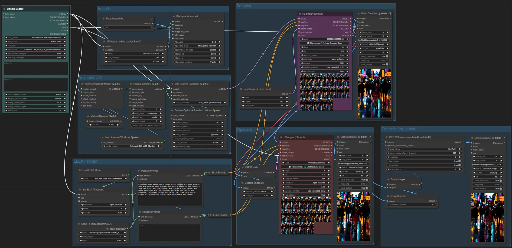

# ComfyUI Workflows by GizAI

Welcome to the official GitHub repository for ComfyUI workflows by [giz.ai](https://www.giz.ai/). This repository features a collection of optimized and easy-to-use workflows designed to enhance your AI video generation projects using the powerful ComfyUI tool.

## About

These workflows are powered by giz.ai, an all-in-one AI and productivity platform. The workflows in this repository are tailored to meet the needs of creators, developers, and researchers working with AI-powered video generation, image manipulation, and more.

## Featured Workflow: AnimateLCM-FaceID

The `AnimateLCM-FaceID.json` workflow is currently featured and available for free beta testing on our platform at [giz.ai/ai-face-video](https://www.giz.ai/ai-face-video/). This workflow integrates the power of the AnimateLCM model with FaceID to create dynamic, realistic face animations directly from text prompts and images. 

## Example Video

Below is an example video generated using the `AnimateLCM-FaceID.json` workflow. The prompt used is sourced from OpenAI's Sora:

> *"A stylish woman walks down a Tokyo street filled with warm glowing neon and animated city signage. She wears a black leather jacket, a long red dress, and black boots, and carries a black purse. She wears sunglasses and red lipstick. She walks confidently and casually. The street is damp and reflective, creating a mirror effect of the colorful lights. Many pedestrians walk about."*
Please note that the FaceID feature was not utilized in this particular example.
[

[](https://www.youtube.com/shorts/Vjpd8e-Tlp8)

## License

All workflows and code in this repository are released under the MIT License, allowing for open and flexible use of these resources.

## How to Use

1. **Clone the repository**:
   ```bash
   git clone https://github.com/GizAI/ComfyUI-workflows.git
   ```

2. **Navigate to the cloned directory**:
   ```bash
   cd ComfyUI-workflows
   ```

3. **Load the workflows** into your ComfyUI setup and start creating amazing AI-generated videos and images.

## Contribution

We welcome contributions from the community! Feel free to open issues for suggestions, improvements, or bug reports. You can also fork this repository and submit pull requests to add your own workflows or improvements to existing ones.

## Contact

For any questions or support, please reach out to us via our [website](https://www.giz.ai/) or [GitHub issues](https://github.com/GizAI/ComfyUI-workflows/issues).

---

**GizAI Team**  
*AI access is a basic human right. GizAI offers the most comprehensive AI and productivity tools at the lowest possible cost.*
